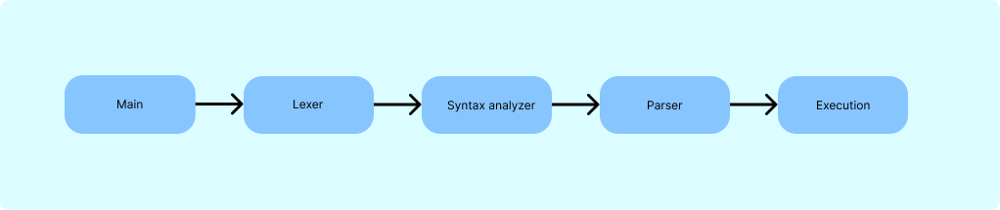
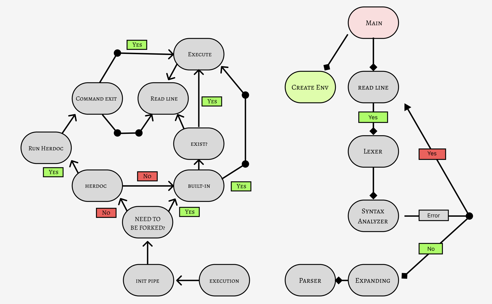

# Minishell

Created: July 29, 2022 3:05 PM
Tags: C Language, School

# Minishell Project

---

## → As beautiful as a shell

> Minishell is a 42-school project that aims to introduce as the world of shells by recoding out mini bash, a program that can parse, execute, and launch executables along with some built-in commands.
> 

## → Used functions :

> readline, rl_clear_history, rl_on_new_line, rl_replace_line, rl_redisplay, add_history, printf, malloc, free, write, access, open, read, close, fork, waitpid, signal, kill, exit, getcwd, chdir, execve, dup2, pipe, perror.
> 

## This is an overview of the project :

## → Lexer :

- input:  Readline output
- output: tokenized linked list
- the objective of this step is to split the readline output using tokens (defined macros)
- used tokens: WORD, REDIRECTION, PIPE, AND, SEMI, PARENTHESIS

---

## → Syntax analyzer:

- input: tokenized linked list
- output:
    - in case of no syntax error: same tokenized linked list.
    - in case of a syntax error: printed error type.
- the objective of this step is to check all possible command syntax errors (if you have a doubt about an error take bash as a reference).

---

## → Parser :

- input: tokenized linked list
- output: commands linked list
- we can split this step into 2 sub-steps
    - handling redirections (input, output, append, heredoc).
    - add command to the linked list with their file descriptors (in and out).

---

## → Execution :

- input: commands linked list
- if everything went okay in the past steps we have 2 different cases to communicate between the commands (processes):
    - if there are $`N`$ commands we initialize $`N-1`$  pipes to communicate between the processes we create.
    - In another case, if there’s some kind of redirection, it takes the priority
- the only step left is to verify if the command is available or not there are two ways to handle it depending on the command itself
    - ****relative path****
    - ****absolute path****
- in this part, the commands are ready to be executed

---

### What is Env or **Environment?**

- shell maintains an environment that includes a set of variables defined by a name, a user initialization, and system initialization.
    - sources that can help you like us:
        - [what is env?](https://docs.oracle.com/cd/E19120-01/open.solaris/819-2379/userconcept-26/index.html)

### What is Lexer or Tokenization?

- Tokenization is a way of separating a sentence into smaller units called tokens,
    - Sources that can help you like us:
        - [what is a lexer?](https://www.guru99.com/compiler-design-lexical-analysis.html)
        - [what is a lexer and how does it work?](https://www.youtube.com/watch?v=TG0qRDrUPpA&t=1094s)
        - ****[What is Tokenization?](https://www.guru99.com/compiler-design-lexical-analysis.html)****

### What is Syntax ****Analysis:****

- It analyses the syntactical structure and checks if the given input is in the correct syntax of the programming language or not.

### What is builtin?

- built-in commands it's just built into the shell itself, while an external command is an external file launched by the shell, the external file may be a binary or some kind of shell script if you use a different version of the shell the builtin while always be available when external could not be installed or need a different supported version.

---

### **How do you define a perfect project?**

- there is no such thing as a perfect project, bash is a large project that was updated years after year for 43 years, for **newbies** like us who have never coded something like this, I'm very proud we did complete this project in 2 months, in the end, the only thing who gonna develop is your knowledge. `~rsaf`

---
